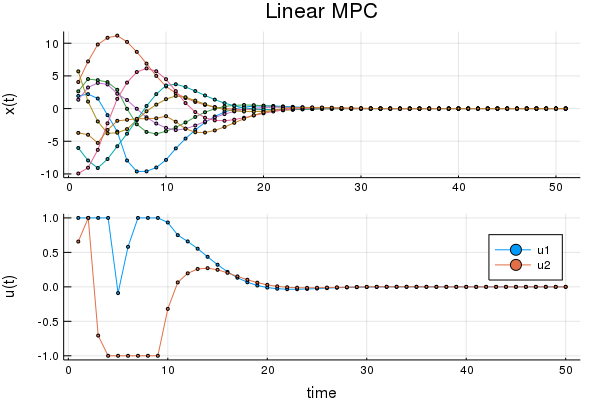
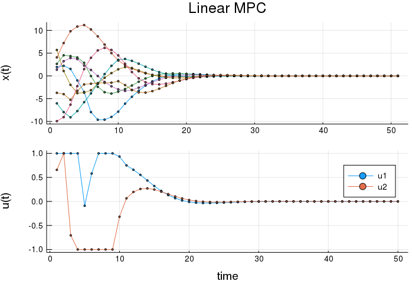

# Convex.jl Sample - Optimal Control of Linear Dynamics
https://nbviewer.jupyter.org/github/cvxgrp/cvx_short_course/blob/master/intro/control.ipynb
* final state equality constraint is tight

```julia
using Convex
using ECOS; solver = ECOSSolver(verbose=0)
# using SCS; solver = SCSSolver(verbose=0)
using LinearAlgebra
using Random

eye(n) = Diagonal{Float64}(I,n)

Random.seed!(6) # feasible for 4,6,13,15,26,48 for ECOS
n = 8
m = 2
T = 50
α = 0.2
β = 5
A = eye(n) + α*randn(n,n)
B = randn(n,m)
x_0 = β*randn(n)

x = Variable(n,T+1)
u = Variable(m,T)

cost = 0
constr = Convex.Constraint[]
for t=1:T-1
    global cost += sumsquares(x[:,t+1]) + sumsquares(u[:,t])
    global constr += [x[:,t+1] == A*x[:,t]+B*u[:,t],
                      norm(u[:,t], Inf) <= 1]
end
constr += [x[:,T] == 0, x[:,1] == x_0]
# constr += [abs(x[:,T]) <= 1e-2, x[:,1] == x_0]
problem = minimize(cost, constr)
@time solve!(problem, solver)
@show problem.status
@show problem.optval
# @show x.value
# @show u.value
```

```julia
using Plots
default(shape=:c, ms=2, legend=false)
figx = plot(x.value', title="Linear MPC", ylabel="x(t)")
figu = plot(u.value', ylabel="u(t)", xlabel="time", labels=["u1" "u2"],  legend=:best)
fig_traj = plot(figx, figu, layout=(2,1))
fname = dirname(@__FILE__) * "/assets/lmpc_traj.png"
savefig(fname)
fig_traj
```


<!--  -->

&copy; Keisuke Uto
