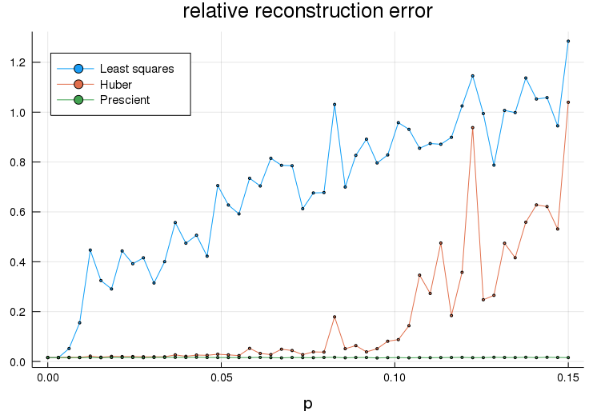
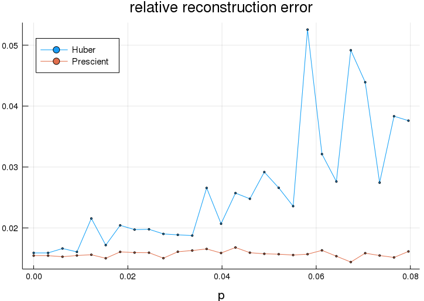

# Huber Regression
* https://nbviewer.jupyter.org/github/cvxgrp/cvx_short_course/blob/master/applications/huber_regression.ipynb
Convex.jl sample

$$
\begin{aligned}
& f(\beta) = \|X \beta - Y\|_2^2 \quad\text{Least Square}\\
& f(\beta) = \sum_i\phi(x_i^T\beta - y_i) \quad\text{Huber regression}\\
\end{aligned}
$$

```julia
# Generate Data
using Random
using Distributions

Random.seed!(0)
n=300
SAMPLES=Int(1.5n)
β_true = 5*randn(n)
X = randn(n, SAMPLES)
Y = zeros(SAMPLES)
v = randn(SAMPLES)
```

```julia
using Convex
using SCS; solver = SCSSolver(verbose=0)
using ECOS; solver = ECOSSolver(verbose=0)
using DataFrames

TESTS = 50
# TESTS = 3
lsq_data = zeros(TESTS)
huber_data = zeros(TESTS)
prescient_data = zeros(TESTS)
p_vals = LinRange(0, 0.15, TESTS)

for (idx, p) in enumerate(p_vals)
    # Generate the sign changes.
    factor = 2*rand(Binomial(1, 1-p), SAMPLES).-1
    Y = factor .* (X'*β_true) + v
    # Form and solve regression problem
    β = Variable(n)
    fit = norm(β - β_true)/norm(β_true)
    cost = norm(X'*β - Y) # Least Square
    solve!(minimize(cost), solver)
    lsq_data[idx] = evaluate(fit)
    cost = norm(factor .* (X'*β) - Y) # Prescient (the sign changes are known)
    solve!(minimize(cost), solver)
    prescient_data[idx] = evaluate(fit)
    cost = sum(huber(X'*β - Y, 1)) # Huber
    solve!(minimize(cost), solver)
    huber_data[idx] = evaluate(fit)
    @info "[$idx]solving ..."
end
```

```julia
using Plots
using LaTeXStrings

plot(title="relative reconstruction error", legend=:topleft, xlabel="p")
plot!(p_vals, lsq_data, label="Least squares")
plot!(p_vals, huber_data, label="Huber")
plot!(p_vals, prescient_data, label="Prescient")
# plot!(ylabel=L"\||\beta - \beta^{\mathrm{true}}\|_2\||\beta^{\mathrm{true}}\||_2") # needs dvipng
```



```julia
using Plots
using LaTeXStrings

indices = p_vals .< 0.08
plot(title="relative reconstruction error", legend=:topleft, xlabel="p")
plot!(p_vals[indices], huber_data[indices], label="Huber")
plot!(p_vals[indices], prescient_data[indices], label="Prescient")
```



&copy; Keisuke Uto
