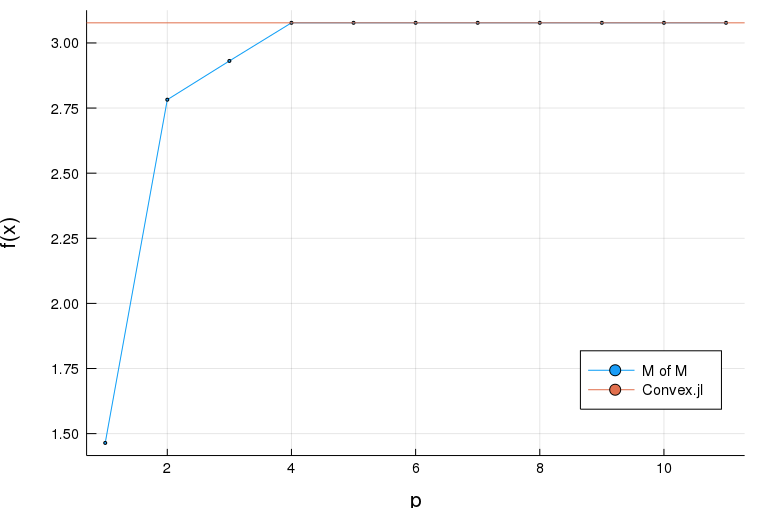
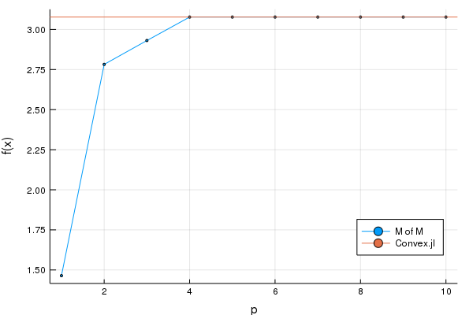

# Method of Multipliers

$$
\begin{aligned}
& \underset{x}{\text{minimize}} & & f(x) = \|x\|_1 \\
& \text{s.t.} & & Ax=b
\end{aligned}
$$

$$
\begin{aligned}
L_\rho(x,y) = f(x)+y^T(Ax-b)+\frac{\rho}{2}\|Ax-b\|_2^2\\
\end{aligned}
$$

$$
\begin{aligned}
& x^{k+1} := \underset{x}{argmin}\; f(x)+y^T(Ax-b)+\frac{\rho}{2}\|Ax-b\|_2^2\\
& y^{k+1} := y^{k} + \rho(Ax^{k+1}-b)
\end{aligned}
$$

```julia
using Convex
# using SCS; solver = SCSSolver(verbose=0)
using ECOS; solver = ECOSSolver(verbose=0)
using Random
Random.seed!(0)

# Initialize data.
MAX_ITERS = 10
ρ = 1.0
n = 20
m = 10
A = randn(m,n)
b = randn(m)

# Initialize problem.
x = Variable(n)
f = norm(x,1) # cost: l1 norm

# solve Convex.jl
prob = minimize(f, [A*x == b])
solve!(prob, solver)
println("Optimal value from Convex.jl: $(prob.optval)")

resid = A*x - b
y = Constant(zeros(m)) # Parameter
aug_lagr = f + y'*resid + (ρ/2)*sumsquares(resid)
fvalue = []

for t=1:MAX_ITERS
    solve!(minimize(aug_lagr), solver)
    copyto!(y.value, y.value + ρ*evaluate(resid))
    global fvalue = [fvalue; evaluate(f)]
end
println("Optimal value from method of multipliers: $(evaluate(f))")
fig = plot(fvalue, xlabel="p", ylabel="f(x)", label="M of M")
hline!([prob.optval], label="Convex.jl", legend=:bottomright)
fname = dirname(@__FILE__) * "/assets/method_of_multipliers.png"
savefig(fname)
fig
```

<!--  -->


&copy; Keisuke Uto
