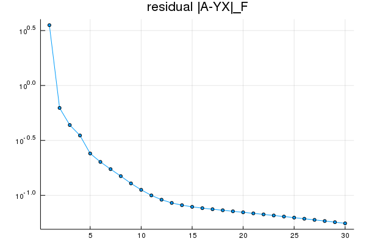
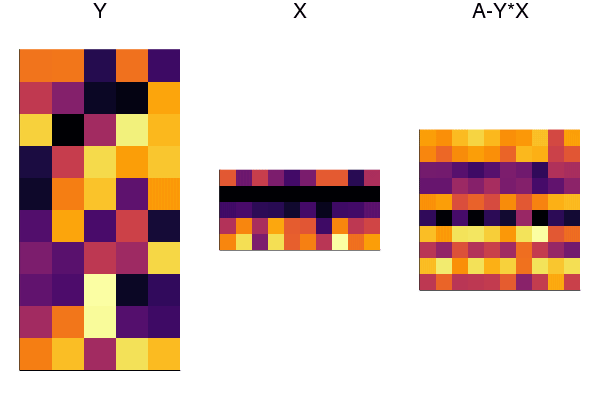

# Nonnegative Matrix Factorization
* https://www.cvxpy.org/examples/applications/nonneg_matrix_fact.html

$$
\begin{aligned}
& \underset{x}{\text{minimize}} & & \|A-YX\|_F \\
& \text{s.t.} & & X \ge 0, \: Y \ge 0\\
\end{aligned}
$$

```julia
using Random
Random.seed!(0)

m,n,k = 10,10,5
A = rand(m,k)*rand(k,n)
Y_init = rand(m,k) # Initialize Y randomly.
```

```julia
using Convex
using SCS; solver = SCSSolver(verbose=0, max_iters=10000)

Y = Y_init
MAX_ITERS = 30
residual = zeros(MAX_ITERS)
Ys = zeros(m, k, MAX_ITERS)
Xs = zeros(k, n, MAX_ITERS)

for iter_num=1:MAX_ITERS
    if isodd(iter_num)
        global X = Variable(k,n)
        constraint = [X >= 0]
    else
        global Y = Variable(m,k)
        constraint = [Y >= 0]
    end
    prob = minimize(norm(vec(A - Y*X)), constraint)
    solve!(prob, solver)

    if prob.status != :Optimal
        @info "Solver did not converge!"
        break
    end
    println("Iteration $iter_num, residual norm $(prob.optval)")
    residual[iter_num] = prob.optval
    if isodd(iter_num)
        X = X.value
    else
        Y = Y.value
    end
    Ys[:,:,iter_num] = Y
    Xs[:,:,iter_num] = X
end
```

```julia
using Plots
fig = plot(residual, title="residual |A-YX|_F", shape=:c, ms=3, yscale=:log10, legend=false)
fname = dirname(@__FILE__) * "/assets/nmf_residual.png"
savefig(fname)
fig
```



```julia
using Plots

anim = @animate for i=1:MAX_ITERS
    figY = heatmap(Ys[:,:,i], aspect_ratio=:equal, xticks=false, ytick=false, title="Y")
    figX = heatmap(Xs[:,:,i], aspect_ratio=:equal, xticks=false, ytick=false, title="X")
    figR = heatmap(A-Ys[:,:,i]*Xs[:,:,i], aspect_ratio=:equal, xticks=false, ytick=false, title="A-Y*X")
    fig = plot(figY, figX, figR, layout=(1,3))
    sleep(0.05)
    display(fig)
end

fname = dirname(@__FILE__) * "/assets/nmf.gif"
gif(anim, fname, fps=5)

```



&copy; Keisuke Uto
