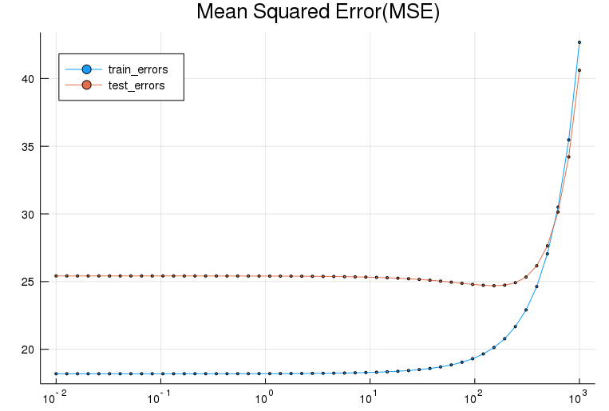

# Ridge Regression
* https://www.cvxpy.org/examples/machine_learning/ridge_regression.html
* https://nbviewer.jupyter.org/github/cvxgrp/cvxpy/blob/1.0/examples/machine_learning/ridge_regression.ipynb

Convex.jl sample

$$
\begin{aligned}
f(\beta) = \|X \beta - Y\|_2^2 +\lambda \|\beta\|_2^2 \\
\end{aligned}
$$


```julia
# Generate Data
using Random
using Distributions

function generate_data(m=100, n=20, σ=5)
  Random.seed!(0)
  β = randn(n)
  X = randn(m,n)
  Y = X*β + rand(Normal(0,σ),m)
  X, Y
end

m, n, σ, N = 100, 20, 5, 50
X,Y = generate_data(m, n, σ)
X_train, X_test = X[1:N,:], X[N+1:end,:]
Y_train, Y_test = Y[1:N,:], Y[N+1:end,:]
```

```julia
# fitting the model
using Convex
using SCS; solver = SCSSolver(verbose=0)
using ECOS; solver = ECOSSolver(verbose=0)
using DataFrames

logspace(start, stop, len) = exp10.(range(start, stop=stop, length=len))
# loss(X,Y,β) = square(norm(X*β-Y))
loss(X,Y,β) = square(norm(X*β-Y))
mse(X,Y,β) = (1.0/size(X,1)) * evaluate(loss(X,Y,β))[1] # dirty

β = Variable(n)
λ = Constant([1.0]) # Parameters
problem = minimize(loss(X,Y,β) +λ*norm(β))
λs = logspace(-2,3,50)

df = DataFrame(
  :train_errors => Float64[],
  :test_errors => Float64[],
  :β_values => Array{Float64,2}[],
)

for v = λs
  copyto!(λ.value, v)
  solve!(problem, solver)
  push!(df, [mse(X_train,Y_train,β), mse(X_test,Y_test,β), β.value])
  @show problem.status
  @show problem.optval
end
```
```julia
# Evaluating the model
using Plots
plot(title="Mean Squared Error(MSE)", xscale=:log10, legend=:topleft)
plot!(λs, df[:,:train_errors], label="train_errors")
plot!(λs, df[:,:test_errors], label="test_errors")
```

